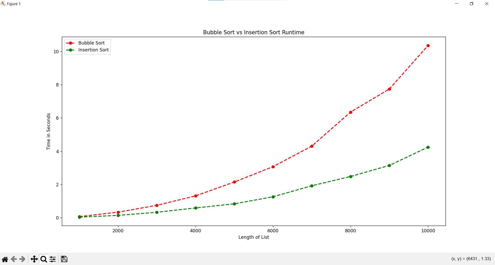

# Sorting Algorithm Analysis

This project compares the runtime performance of Bubble Sort and Insertion Sort using randomly generated lists of integers.

## What This Project Does

- Implements Bubble Sort
- Implements Insertion Sort
- Generates random lists
- Measures runtime using time.perf_counter()
- Graphs results using matplotlib

## How to Run

Install dependencies:

pip install -r requirements.txt

Run the program:

python sort_timer.py

## Example Output

## What I Learned

- How sorting algorithms behave as input size increases
- Why O(n²) algorithms become slow quickly
- How to visualize data using matplotlib
